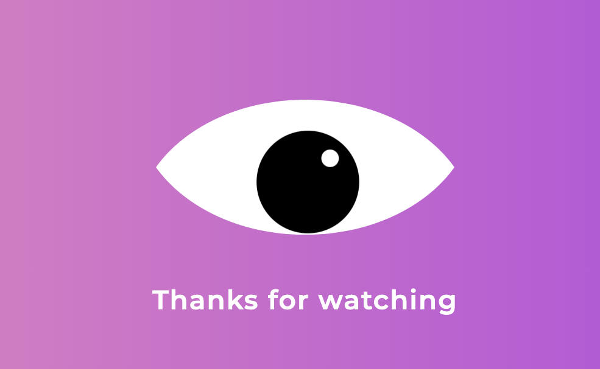

# The Awwwesomes workshops

In this project direcotry are exercises from The Awwwesomes workshops: “It’s a kind of magic - poznaj supermoce CSS-a".

## CSS drawing make me happy!

I left this "a little bit of everything repository" because:

- I belive that "CSS is a kind of magic"
- I really enjoy drawing with CSS
- This workshops ware amazing! [The Awwwesomes](https://theawwwesomes.org/)

You can find my CSS drawings at my [CodePen](https://codepen.io/martakmb).

